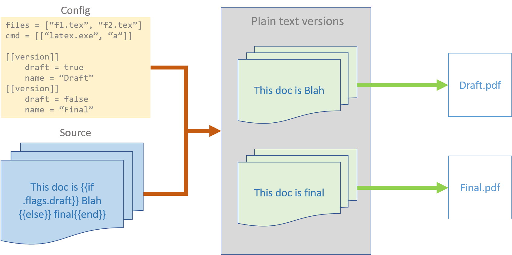

# teXembler

Assemble versions of documents from source text.

Use cases:

* CVs with different focus,
* Draft/Final versions,
* Same letter with different names
* Any text-based template

## How it works

`teXembler` works in 2 steps:

* **Text parsing**: The source text files are parsed, and separate versions are generated based on `config` file.

* **Document assembly**: Each version of source files is passed to a command specified in `config` file `cmd` key. The command may be empty or something else (latex compilation etc.)



## Usage

```
> teXembler.exe -config CONFIG
```

Where `CONFIG` is name of config file.

### Config file

A config file contains instructions on how to assemble source text into the final document. It contains details to be used in each version of the final document.

All config files must contain the following fieids:

```
# list of source text files. File paths are relative to the config file.
files = []

# commands to execute after source files have been parsed
cmd = []

# For each version
[[version]]
    key = value
    key = value


[[version]]
    key = value
    key = value
```

During assembly, all top-level settings are *sifted* down to each version's settings and are available for use:

```
[[version]]
    files = []    # sifted down from top-level for each version
    cmd = []
    key = value
    key = value
```

### Text templates

`teXembler` processes source text files specified in `files` as templates. Templates use [Go template syntax][1]. The source files are assembled for each version in configuration. All configuration settings are available to templates. For example:

```
The following files are in config:
{{range $f := .files}}
File name: {{$f}}
{{end}}

If your config file has a version with a key "isDraft".
{{ if eq .isDraft "draft" }}
This will only show for versions that have a isDraft=draft.
{{end}}

This will show up in all cases.
```

### Config commands

Config commands invoke another executable with arguments. Each part of the command is specified separately. The `cmd` key in the config file is a list of lists. So to run poweershell commands, like `remove-item`, the command string neds to be passed to `powershell.exe`:

```
cmd = [
    ["powershell.exe", "-command", "& {remove-item example.ext}"],
    ["powershell.exe", "script.ps1"]
]
```

Commands themselves are templates. So a command can refer to other settings in config:

```
files = ["files/f1.md", "files/f2.md"]
cmd = [
    ["some-exe.exe", "-flag", "{{index .files 0}}]
]
```

*Note*: Files should be referred to in the above way i.e. by position `index .files LOCATION`. If files are referred to by their name, the original source file will be used instead of a temporary file parsed from the template.


[1]: https://golang.org/pkg/text/template/